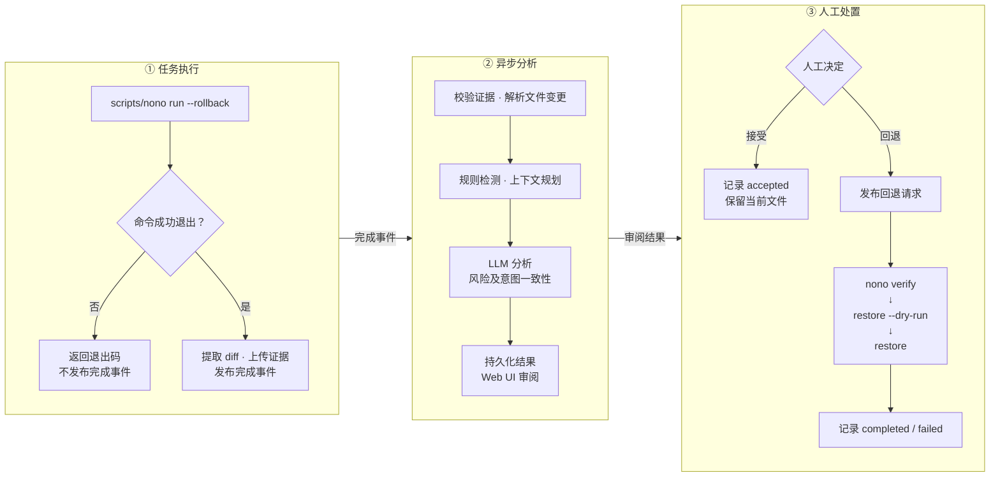

<div align="center">


**面向AI Agent提供安全沙箱，实时检测原始请求与工作空间变更的一致性，自动识别风险并支持异常会话的一键回滚**

 [](ai_agent/pyproject.toml)  [](LICENSE)

</div>

AgentRewindRT基于[nono](https://github.com/nolabs-ai/nono)提供沙箱和快照回滚等基础运行时安全功能，并进一步扩展了智能体会话级意图与变更一致性安全分析能力。AgentRewindRT实时监测智能体工作空间变更，在变更与原始意图背离时自动发出告警和处置建议，用户可选择接受变更或请求恢复到指定快照。

项目适用于需要保留变更证据、检查智能体是否超出任务范围，并在审阅后恢复工作区文件的AI Agent工作场景。当前智能体会话级意图与变更一致性安全分析发生在会话结束之后，其无需在会话执行中要求用户的多次授权与处置，仅在会话结束后提供一次性告警，大大缓解传统智能体安全沙箱的告警疲劳问题。

## 核心能力

| 能力 | 说明 |
| --- | --- |
| 隔离执行 | 基于 nono 的权限策略约束智能体命令的文件系统与网络访问范围。 |
| 工作区快照管理 | 利用 nono 创建并查询工作区文件快照，将快照与任务会话关联，为变更分析和回退提供依据。 |
| 文件恢复 | 调用 nono 的快照恢复机制，将快照覆盖的工作区文件恢复至指定快照状态。 |
| 会话级意图与变更一致性安全分析 | 结合原始任务、代码差异、敏感路径及危险模式规则，通过大语言模型评估变更与任务意图的一致性、潜在风险及建议处置方式。 |
| 工作区会话级回退 | 以任务会话为单位关联回退请求与 nono 快照，经人工确认后异步执行文件恢复，并记录回退状态与结果。 |
| 分级上下文策略 | 依据代码差异的估算词元（token）数量，选择文件级分析、变更块摘要或风险优先策略，以控制分析上下文规模。 |
| 人工审阅与处置 | 通过 Web 界面呈现会话、变更证据及分析结果，支持人工接受变更、发起回退和管理会话记录。 |

## 系统架构


*实线表示事件、证据和 API 数据流；绿色虚线表示人工请求后的文件恢复路径。工作区与 nono 状态目录必须以相同绝对路径挂载到后端容器。*

| 组件 | 职责 |
| --- | --- |
| 宿主机 `scripts/nono` | 是对nono的一层封装，调用真实 nono，提取 diff，上传证据并发布完成事件 |
| Kafka | 传递 `agent.session.finished`、`agent.rollback.requested` 与 `agent.rollback.completed` 事件 |
| MinIO | 保存 diff；Kafka 事件携带证据引用及摘要，而非完整 diff |
| `ai-agent` | 单进程运行 Kafka 消费、LangGraph 分析流程、回退执行器和 FastAPI 接口 |
| PostgreSQL | 保存 `agent_sessions`、`agent_adjudications`、`agent_rollbacks` 三张业务表 |
| `web-ui` | 提供审阅页面，通过服务端代理访问后端 API |

### 运行流程

整体流程分为会话执行、异步分析和人工处置三个阶段：会话成功退出后，系统上传变更证据并发布完成事件，由后端异步完成规则检测和 LLM 分析。用户在 Web UI 中审阅结果，选择接受变更或请求回退；回退由人工发起，依次经过快照校验、恢复预演和实际恢复，并记录执行结果。



分析使用 [上下文规划器](ai_agent/agent_guard/context_planner.py) 与 [LangGraph 裁决图](ai_agent/agent_guard/adjudication_graph.py)，上下文规划器按照diff文件的大小采取不同的处理方式，如下表所示。

| 策略 | 默认选择条件 | 处理方式 |
| --- | --- | --- |
| `file_level` | 估算 token 数 ≤ 40,000 | 直接进行会话级裁决 |
| `hunk_summary` | 40,000 < 估算 token 数 ≤ 300,000 | 逐文件生成摘要，再汇总裁决 |
| `risk_only` | 估算 token 数 > 300,000 | 标记高风险文件，以更小的文件内容预算生成摘要并汇总 |

这些是token数为默认阈值。随仓库提供的 Compose 为方便验证三种策略，将两级阈值设为 **200 / 800**，文件与 hunk 预算设为 **300 / 80**。摘要数量及内容长度均有上限，因此大 diff 分析不等于对所有修改的完整审查。

### 如何解读分析结果

会话详情将模型分析、人工决定和回退执行状态分别记录。审阅时，应结合原始任务、文件 diff 与以下字段判断是否接受变更：

| 字段 | 取值或内容 | 含义 |
| --- | --- | --- |
| `adjudication.verdict` | `allow` / `warn` / `deny` / `needs_human_review` | 分析裁决 |
| `adjudication.risk_level` | `low` / `medium` / `high` / `critical` | 结合模型输出与规则下限得到的风险等级 |
| `adjudication.intent_alignment` | `aligned` / `partially_aligned` / `out_of_intent` / `unknown` | 变更与原始任务的一致程度 |
| `adjudication.summary` / `findings` | 分析摘要与具体发现 | 裁决依据，需与实际 diff 对照 |
| `adjudication.recommended_action` | `accept` / `ask_user` / `rollback` | 建议处置方式 |
| `decision` / `rollback_status` | 人工决定与回退状态 | 区分审阅决定、回退请求和实际执行结果 |

风险等级存在代码约束。例如，意图一致性为 `unknown` 时最低为 `medium`；明确超出任务范围，且会话中同时出现敏感路径和危险模式时，最低为 `critical`。这些约束见 [裁决结果归一化与风险下限](ai_agent/agent_guard/adjudicator.py)。

token 数使用字符长度近似估算，非模型 tokenizer 的精确计数。实际上下文容量和模型输出仍需结合所选模型验证。

## 快速开始

以下步骤面向**同一台 Linux x86_64 主机上的本地部署**，从仓库根目录执行。当前 Compose 挂载宿主机的 `/lib64`、`/lib/x86_64-linux-gnu` 和 nono 二进制；其他架构或系统需要调整部署文件。

准备好：

- Docker 与 Docker Compose，以及 Python **3.11+**。
- 真实的 nono 可执行文件，支持 `run --rollback` 和 `rollback show / verify / restore`；仓库不包含 nono 本体。
- 可访问的 OpenAI 兼容 Chat Completions 服务及模型凭据，用于后端分析。
- 如需执行真实智能体任务，另行安装对应智能体 CLI，并配置其模型、凭据和 nono 权限。

### 1. 环境配置与服务启动

在同一终端中完成配置；示例中的模型与凭据需要替换为实际值。

```bash
export REPO_ROOT="$PWD"
export DEEPXDR_REAL_NONO='/usr/local/bin/nono'
"$DEEPXDR_REAL_NONO" --version

mkdir -p .tmp/agentguard-workspaces .tmp/agentguard-nono-state
export AGENTGUARD_WORKSPACE_ROOT="$(realpath .tmp/agentguard-workspaces)"
export AGENTGUARD_NONO_STATE_ROOT="$(realpath .tmp/agentguard-nono-state)"

export OPENAI_BASE_URL='https://your-model-provider.example/v1'
export OPENAI_MODEL='your-model-id'
export OPENAI_API_KEY='replace-with-your-model-api-key'
export BACKEND_API_KEY='replace-with-a-strong-backend-api-key'

./scripts/agentguard-compose config --quiet
./scripts/agentguard-compose up -d --build
./scripts/agentguard-compose ps
```

两个根目录必须是已存在、不同且不为 `/` 的绝对目录。使用 `scripts/agentguard-compose` 启动，由它校验路径并传入 Compose 所需变量。

首次启动需要下载镜像并安装依赖。`minio-init` 创建 `agent-diffs` bucket 后正常退出，其余五个服务应保持运行。查看日志并检查接口：

```bash
./scripts/agentguard-compose logs --tail=100 ai-agent web-ui
curl -fsS http://localhost:8000/health
curl -fsS -H "X-API-Key: $BACKEND_API_KEY" \
  'http://localhost:8000/agent-sessions?page=1&size=20'
```

`/health` 反映接口及组件装配状态；真实模型调用、证据读取与文件恢复需要通过后续任务验证。

| 服务 | 宿主机访问地址 |
| --- | --- |
| 审阅界面 | <http://localhost:30003> |
| 后端 API | <http://localhost:8000> |
| MinIO API / 控制台 | <http://localhost:9000> / <http://localhost:9001> |
| Kafka | `localhost:29092` |
| PostgreSQL | `localhost:15432` |

### 2. 配置宿主机接入入口

容器中的依赖不会自动安装到宿主机。为 `scripts/nono` 准备独立虚拟环境，并配置宿主机可访问的 Kafka 与 MinIO 地址：

```bash
python3 -m venv .venv
.venv/bin/pip install 'boto3>=1.35,<2.0' 'aiokafka==0.11.0'
source .venv/bin/activate

export KAFKA_BOOTSTRAP_SERVERS='localhost:29092'
export DEEPXDR_AGENT_SESSION_TOPIC='agent.session.finished'
export DEEPXDR_NONO_STATE_HOME="$AGENTGUARD_NONO_STATE_ROOT"
export AGENT_GUARD_DIFF_STORAGE='minio'
export AGENT_GUARD_DIFF_BUCKET='agent-diffs'
export AGENT_GUARD_DIFF_PREFIX='agent-diff-evidence'
export AGENT_GUARD_DIFF_ENDPOINT_URL='http://localhost:9000'
export AGENT_GUARD_DIFF_ACCESS_KEY_ID='minioadmin'
export AGENT_GUARD_DIFF_SECRET_ACCESS_KEY='minioadmin'
```

上述 MinIO 凭据与本地 Compose 一致。容器内部使用 `kafka:9092` 和 `http://minio:9000`，这些地址不应直接复制到宿主机配置中。

### 3. 生成第一条分析会话

使用专用的可丢弃工作区运行 `small` 用例：

```bash
export AGENTGUARD_SMOKE_WORKSPACE="$AGENTGUARD_WORKSPACE_ROOT/smoke-workspace"
unset DEEPXDR_AGENT_RUN_ID DEEPXDR_AGENT_ORIGINAL_REQUEST
./scripts/agentguard-smoke-nono.sh small
```

**冒烟脚本会删除并重建指定测试目录，请勿将其指向真实项目。** `small` 用例通过复制预设文件模拟变更，不启动真实智能体，但会使用真实 nono、Kafka、MinIO 和后端模型。

打开 <http://localhost:30003>，按脚本输出的 run ID 查找会话，查看 diff、风险与意图分析。接受操作记录人工决定并保留文件；回退操作异步恢复快照，应等待 `rollback_status` 变为 `completed` 并检查工作区文件。

### 4. 接入真实智能体

将项目放入工作区根目录下，并将 `your-agent-command` 替换为实际智能体程序及参数：

```bash
export WORKSPACE="$AGENTGUARD_WORKSPACE_ROOT/my-project"
mkdir -p "$WORKSPACE"
cd "$WORKSPACE"

export DEEPXDR_AGENT_ORIGINAL_REQUEST='为项目添加单元测试'
export DEEPXDR_AGENT_RUN_ID="run-$(date +%Y%m%d%H%M%S)"

"$REPO_ROOT/scripts/nono" run --rollback --no-rollback-prompt \
  --allow "$WORKSPACE" -- your-agent-command

cd "$REPO_ROOT"
```

`--` 后的命令决定实际执行任务的智能体。`DEEPXDR_AGENT_ORIGINAL_REQUEST` 用于记录分析依据，**不会自动把任务传给智能体**；请通过该 CLI 的参数或交互入口提交任务，并配置所需文件与网络权限。后端的 `OPENAI_*` 变量也不会自动配置智能体模型。

更多示例、`medium` / `large` 策略验证以及 OpenCode 接入见 [智能体接入与冒烟测试指南](deploy/AGENTGUARD_SMOKE.md)。

## 配置参考

| 配置项 | 用途与注意事项 |
| --- | --- |
| `OPENAI_BASE_URL` / `OPENAI_MODEL` / `OPENAI_API_KEY` | 后端分析服务地址、模型和凭据；当前 Compose 要求三者均配置 |
| `BACKEND_API_KEY` | 后端会话 API 的共享密钥；Web UI 使用同一值代理请求 |
| `AGENTGUARD_WORKSPACE_ROOT` | 允许挂载的工作区根目录 |
| `AGENTGUARD_NONO_STATE_ROOT` | 允许挂载的 nono 状态根目录 |
| `DEEPXDR_REAL_NONO` | 宿主机真实 nono 路径；必须与包装入口区分 |
| `DEEPXDR_NONO_STATE_HOME` | 宿主机入口使用的状态目录，应位于上述状态根目录内 |
| `KAFKA_BOOTSTRAP_SERVERS` | Kafka 地址；宿主机与容器分别配置 |
| `DATABASE_URL` | 后端 PostgreSQL 连接串，Compose 已提供；仅支持 PostgreSQL |
| `AGENT_GUARD_DIFF_STORAGE` | 证据存储类型：`local`、`s3` 或 `minio`；Compose 使用 MinIO |
| `AGENT_GUARD_DIFF_BUCKET` / `AGENT_GUARD_DIFF_PREFIX` | 对象存储 bucket 与写入前缀 |
| `AGENT_GUARD_DIFF_ENDPOINT_URL` | 对象存储服务地址 |
| `AGENT_GUARD_DIFF_ACCESS_KEY_ID` / `AGENT_GUARD_DIFF_SECRET_ACCESS_KEY` | 对象存储凭据 |
| `AGENT_GUARD_MAX_DIFF_READ_BYTES` | 单份 diff 读取上限，默认 8 MiB |
| `AGENT_GUARD_SMALL_DIFF_TOKEN_LIMIT` / `AGENT_GUARD_MEDIUM_DIFF_TOKEN_LIMIT` | 分析策略切换阈值，注意 Compose 覆盖了代码默认值 |

完整分析预算、超时与重试设置见 [config.py](ai_agent/agent_guard/config.py)；实际容器配置见 [Compose 文件](deploy/docker-compose-agentguard.yml)。修改后端模型环境变量后，使用 `./scripts/agentguard-compose up -d --force-recreate ai-agent` 重建容器以加载配置。

历史兼容名称 `AgentGuard`、`deepxdr` 和 `DEEPXDR_*` 仍用于部分包、镜像与环境变量，配置时请使用代码中的实际名称。背景见 [项目命名说明](docs/project-rename.md)。

## API

除 `/health` 外，后端会话接口均要求 `X-API-Key: <BACKEND_API_KEY>`。Web UI 在端口 `30003` 下使用 `/api/agent-sessions...` 代理这些接口。

| 方法 | 后端路径 | 行为 |
| --- | --- | --- |
| `GET` | `/health` | 返回服务与组件状态 |
| `GET` | `/agent-sessions?page=1&size=20` | 分页查询，`size` 最大为 100 |
| `GET` | `/agent-sessions/{run_id}` | 查看会话及分析结果 |
| `POST` | `/agent-sessions/{run_id}/accept` | 将人工决定标记为 `accepted` |
| `POST` | `/agent-sessions/{run_id}/rollback` | 请求恢复指定快照，默认 `snapshot=0` |
| `DELETE` | `/agent-sessions/{run_id}` | 删除会话记录；进行中的回退可能阻止删除 |

回退请求体示例：

```json
{"requested_by": "reviewer", "snapshot": 0}
```

回退接口返回 `rollback_id` 与 `rollback_status`。请求成功不代表恢复完成，需要继续查询会话。后端按顺序执行 `nono rollback verify`、`restore --dry-run`、`restore`；任一步失败即停止后续命令并记录失败结果。

## 开发与测试

后端与 Web UI 的 FastAPI 依赖版本不同，本地开发请使用独立虚拟环境。后端及测试环境可按以下方式准备：

```bash
python3 -m venv .venv-dev
.venv-dev/bin/pip install -e './ai_agent[dev]' requests httpx
.venv-dev/bin/python -m pytest tests -q
```

测试覆盖证据解析、上下文规划、裁决、消息消费、API、回退及页面行为。真实 nono 测试在缺少二进制时会跳过；完整部署链路仍需按冒烟指南验证。组件启动方式见 [后端文档](ai_agent/README.md) 与 [Web UI 文档](web_ui/README.md)。

```text
AgentRewindRT/
├── ai_agent/
│   ├── agent_guard/       # 接入、证据、分析、消息消费与回退
│   ├── api_server/        # 健康检查和会话 API
│   └── shared/            # PostgreSQL 模型、连接与公共配置
├── web_ui/                # FastAPI 代理、页面和静态资源
├── scripts/               # nono 入口、Compose 路径校验与冒烟用例
├── deploy/                # Compose、数据库迁移和接入指南
├── docs/                  # 部署手册、设计说明与图示
└── tests/                 # 单元、组件与流程测试
```

提交变更时，请补充必要的验证说明，并使用 `feat:`、`fix:`、`docs:`、`test:` 等约定前缀编写提交信息。

## 故障排查与延伸文档

| 现象 | 优先检查 |
| --- | --- |
| 命令完成但页面无会话 | 是否通过包装入口执行且成功退出；宿主机 Kafka 地址是否配置；上传和后端分析日志是否报错 |
| 模型请求返回 404 | 后端的 base URL、模型 ID、服务权限；如执行真实智能体，还需检查该智能体自己的模型配置 |
| `nono: Session not found` | `state_home` 是否位于挂载根目录内，容器与宿主机绝对路径是否一致 |
| `evidence_invalid` | 对象是否可读、SHA-256 是否匹配、diff 是否超过读取上限 |
| 会话接口返回 401 / 503 | 后端密钥及 Web UI 配置是否一致，仓库和回退发布器是否初始化完成 |

- [部署与测试验证手册](docs/agentguard-deployment-validation.md)：环境准备、构建、代理与验收。
- [智能体接入与冒烟测试](deploy/AGENTGUARD_SMOKE.md)：真实任务接入与三种分析策略验证。
- [后端说明](ai_agent/README.md) / [Web UI 说明](web_ui/README.md)：组件职责、配置和接口。

停止服务并保留数据卷：`./scripts/agentguard-compose down`。

## 许可证

本项目采用 [MIT License](LICENSE)。Copyright © 2026 Purple Mountain Laboratories。
